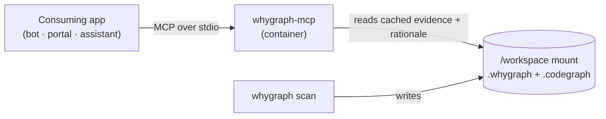

# WhyGraph as a service

Editors aren't the only thing that can talk to WhyGraph. The MCP server is a plain stdio program, so
any application that speaks MCP can connect to it for git-based analysis of a target repo. Think of a
review bot, an onboarding assistant, or an internal dev portal that needs the *why* behind a chunk of
code - not just the code.

This page covers that model: a containerized `whygraph-mcp` endpoint a third-party app drives over
MCP, reading the same on-disk data your scan produces.

## The shape of it

A consuming app launches the WhyGraph image, mounts the target repo at `/workspace`, and speaks MCP
over stdio. The scan **writes** the databases; the MCP server **reads** them. One repo on disk is the
single source of truth.



The consuming app gets the full read surface over MCP:

- **Evidence** - `whygraph_evidence_for` and `whygraph_area_history` for the commits, PRs, and issues
  behind a path or symbol.
- **Rationale** - `whygraph_rationale_brief` for a structured why-this-exists card.
- **Resources** - `whygraph://commit/{sha}`, `whygraph://pr/{number}`, `whygraph://issue/{number}`,
  and `whygraph://repo/overview`.

See the [MCP surface reference](../reference/mcp.md) for exact signatures.

## Scan first

The server reads cached data - it doesn't crawl on demand. So the target repo must be scanned before
an app connects, or the tools have nothing to return.

```bash
cd /path/to/target-repo
whygraph scan
```

!!! warning "An unscanned repo returns nothing"
    `whygraph_rationale_brief` raises an error when a target maps to no scanned commit, and the
    evidence tools come back empty. Run `whygraph scan` (and keep it fresh with
    [git hooks](../guide/scanning.md#keep-it-fresh)) before pointing an app at the server.

## Launch the endpoint

The MCP server runs from the same image as everything else. Mount the target repo and run
`whygraph-mcp`:

```bash
docker run --rm -i \
  -v "/path/to/target-repo:/workspace" -w /workspace \
  ghcr.io/mtrdesign/whygraph whygraph-mcp
```

The `-i` flag keeps stdin open for the MCP stdio transport. Your app spawns this command and talks
JSON-RPC to it, exactly as an editor would. The [`install.sh` shim](docker.md) wraps the same call as
a bare `whygraph-mcp` on `PATH`.

## Credentials

What the app needs depends on what it asks for:

- **Reading cached evidence and rationale needs no credentials.** It's all in the mounted databases.
- **Generating a *new* rationale card needs an LLM key.** `whygraph_rationale_brief` calls the
  configured provider on a cache miss. Supply the key through the environment
  (`ANTHROPIC_API_KEY`, `OPENAI_API_KEY`, `DEEPSEEK_API_KEY`) or the repo's `whygraph.toml`
  `[llm.*]` table.

!!! info "Tokens never live in the image"
    Pass credentials at run time via env or the gitignored `whygraph.toml` - never bake them into a
    built image. This matches WhyGraph's own invariant for the Docker shim.

## Current scope

Today the server speaks MCP over **stdio, one session per process**. There's no long-running HTTP
endpoint yet - each connection is its own `docker run`. A persistent server mode with an HTTP MCP
transport is on the [roadmap](../roadmap.md), not built.

For now, model your integration as "spawn a session, run the tools you need, let it exit" - the same
lifecycle an editor uses, driven by your app instead.
