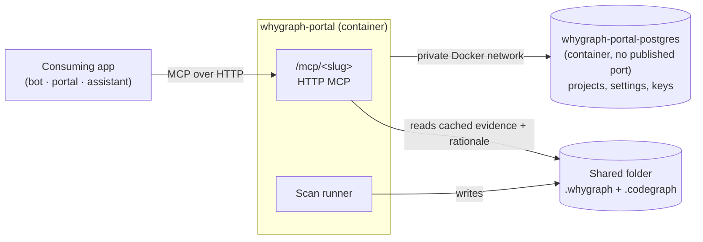

# WhyGraph as a service

Editors aren't the only thing that can talk to WhyGraph. The [portal](../portal/index.md) is a
long-running server, and each project on it has an **HTTP MCP endpoint**, so any application that
speaks MCP can connect to it for git-based analysis of a target repo. Think of a review bot, an
onboarding assistant, or an internal dev portal that needs the *why* behind a chunk of code - not just
the code.

This page covers that model: the `whygraph-portal` container (with its database container,
`whygraph-portal-postgres`) as the service, and a third-party app driving a project's endpoint over
MCP.

## The shape of it

The portal container is the long-lived service. It mounts your shared folders, runs the scans that
**write** each project's databases, and serves the MCP endpoints that **read** them. Its own data -
the project list, settings, keys and scan history - is in Postgres, in a second container on a private
Docker network. A consuming app connects over HTTP, to the portal only.


```mermaid
flowchart LR
    app["Consuming app<br/>(bot · portal · assistant)"]
    subgraph svc["whygraph-portal (container)"]
        mcp["/mcp/&lt;slug&gt;<br/>HTTP MCP"]
        scan["Scan runner"]
    end
    pg[("whygraph-portal-postgres<br/>(container, no published port)<br/>projects, settings, keys")]
    repo[("Shared folder<br/>.whygraph + .codegraph")]

    app -- "MCP over HTTP" --> mcp
    mcp -- "reads cached evidence + rationale" --> repo
    scan -- "writes" --> repo
    svc -- "private Docker network" --> pg
```

The endpoint for a project is `http://127.0.0.1:<port>/mcp/<slug>` (port `8765` by default; the slug is
shown in the **Connect your agent** panel on the project's home page). It is a stateless Streamable HTTP MCP endpoint: each request stands on its
own, so there is no session to keep open or expire.

The consuming app gets the full read surface over MCP:

- **Evidence** - `whygraph_evidence_for` and `whygraph_area_history` for the commits, PRs, and issues
  behind a path or symbol.
- **Rationale** - `whygraph_rationale_brief` for a structured why-this-exists card.
- **Resources** - `whygraph://commit/{sha}`, `whygraph://pr/{number}`, `whygraph://issue/{number}`,
  and `whygraph://repo/overview`.

See the [MCP surface reference](../reference/mcp.md) for exact signatures.

## Stand it up

```bash
whygraph up --add-folder /path/to/repos     # start the portal, share the repos
```

That starts both containers, the database first; `up` waits for it to be ready before it starts the
portal. Then add the target repository in the portal and run its first scan
([Adding projects](../portal/projects.md)). Both containers restart with Docker, so the endpoint is
there whenever the machine is. Back the portal's database up with `whygraph backup`
([Backup and restore](../portal/backup.md)).

!!! warning "An uninitialized or unscanned project returns nothing useful"
    The endpoint answers `409` until the project is initialized in the portal. On an initialized but
    unscanned project, `whygraph_rationale_brief` raises an error when a target maps to no scanned
    commit, and the evidence tools come back empty. Keep projects fresh with the
    [git hooks](../guide/scanning.md#keep-it-fresh) and the portal's catch-up scans.

## Credentials

What the app needs depends on what it asks for:

- **Reading cached evidence and rationale needs no credentials from the app.** The endpoint has no
  authentication of its own in this release (see below).
- **Generating a *new* rationale card needs an LLM key** in the portal. `whygraph_rationale_brief` calls
  the project's configured provider on a cache miss, using the key stored under the portal's Settings.
  See [LLM providers](../reference/llm-providers.md).

!!! info "Keys live in the portal, not in the image or your shell"
    Keys are entered in the portal and stored encrypted in its data directory. Nothing from the host
    environment is passed into the container, and nothing is baked into the image.

## An external Postgres

The portal reads its database from `WHYGRAPH_DATABASE_URL` (and an optional
`WHYGRAPH_DATABASE_PASSWORD_FILE`), which the shim sets to its own database container. Pointing it at
a Postgres you run yourself is possible - see [`whygraph portal`](../reference/cli.md#whygraph-portal)
for what it requires, including no pooler or a session-mode one - but it is not a supported setup in
this release; it will be documented in full with production mode.

## Current scope

The portal is a **local-mode** service: published to `127.0.0.1` only, with no login. It accepts
requests whose `Host` is the loopback address and port, and rejects browser cross-origin requests, so
the consuming app has to run on the same machine. There is no bearer-token authentication and no
remote exposure yet; both are on the [roadmap](../roadmap.md).

!!! note "Not for shared machines"
    Every user of the machine can reach the loopback port. See the
    [security model](../portal/security.md#shared-machines) before running the portal anywhere other
    people log in.
