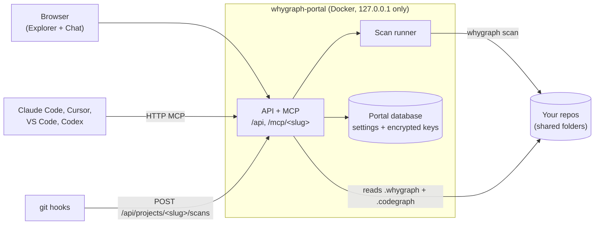

# The portal

The portal is WhyGraph's front door. It is **one long-running server** that holds all your projects,
shows each one in the Explorer and the Chat assistant, runs every scan, and serves each project's
evidence and rationale to your coding agents over HTTP MCP at `/mcp/<slug>`.

You start it once with `whygraph up`, open it in a browser, and add repositories from the Projects
page. There is no per-repo setup command: the portal does what `whygraph init` used to do, with a
preview of every file it will touch.

## What lives where

| Thing | Where |
|---|---|
| Portal settings, project list, API keys and GitHub tokens (encrypted) | The portal's data directory, `~/.local/share/whygraph` on your host |
| A project's evidence, descriptions, rationale cache and chat history | The repository itself, in `.whygraph/whygraph.db` |
| A project's CodeGraph index | The repository itself, in `.codegraph/` |
| Clones of GitHub repositories you added by URL | Under the data directory, in `repos/<slug>` |
| The folders, port and image the portal was started with | `~/.config/whygraph` on your host |

Because each project's databases stay in its own repository, removing a project from the portal
never deletes your history, and a 1.x repository keeps the data it already has. See
[Upgrading from 1.x](upgrading.md).

## Where to next

-   :material-play-circle-outline:{ .lg .middle } __Start the portal__

    ---

    `whygraph up`, the first-run setup, and the other host commands.

    [:octicons-arrow-right-24: Start the portal](start.md)

-   :material-folder-network-outline:{ .lg .middle } __Shared folders__

    ---

    The portal runs in Docker and only sees the folders you share with it.

    [:octicons-arrow-right-24: Shared folders](shared-folders.md)

-   :material-source-repository:{ .lg .middle } __Adding projects__

    ---

    A local repo or a GitHub URL, configure, initialize, first scan.

    [:octicons-arrow-right-24: Adding projects](projects.md)

-   :material-connection:{ .lg .middle } __Connecting agents__

    ---

    The MCP entry each agent gets, and what to know about ports and approval prompts.

    [:octicons-arrow-right-24: Connecting agents](agents.md)

-   :material-shield-lock-outline:{ .lg .middle } __Security model__

    ---

    Loopback only, where keys live, and what the portal will not do to your repo.

    [:octicons-arrow-right-24: Security model](security.md)

-   :material-update:{ .lg .middle } __Upgrading from 1.x__

    ---

    Add your existing repos like new ones; their data is reused.

    [:octicons-arrow-right-24: Upgrading](upgrading.md)

