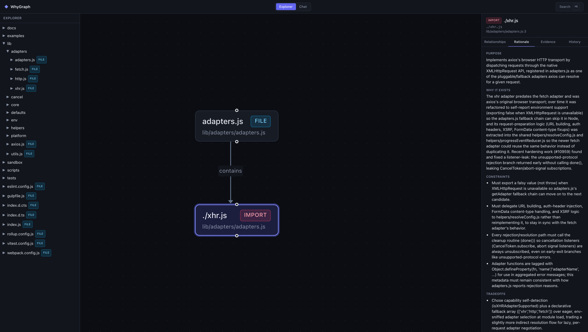
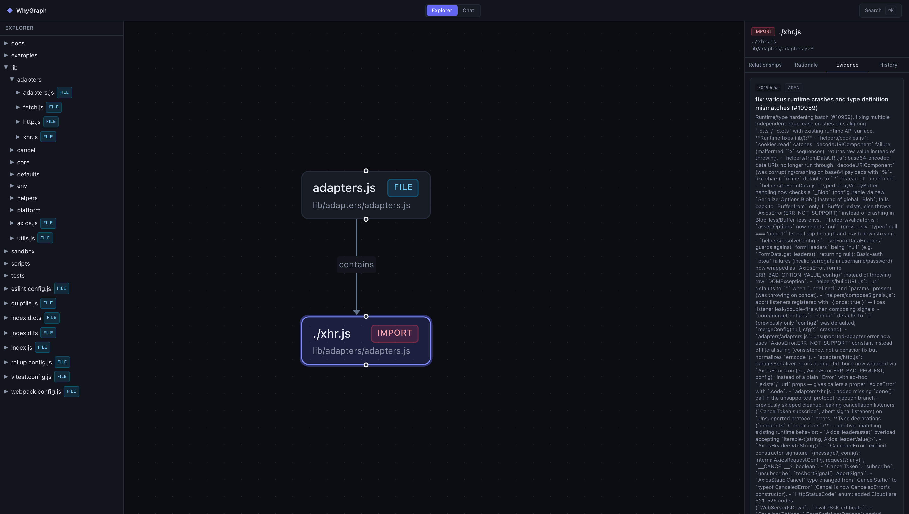
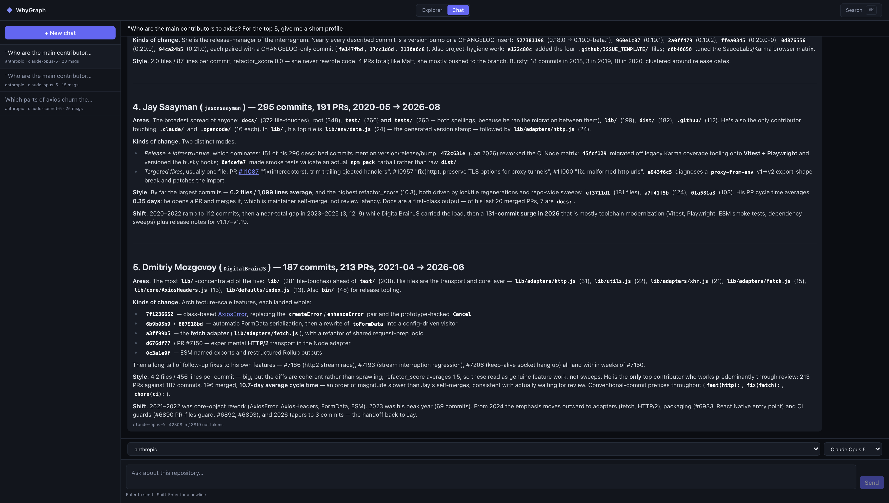
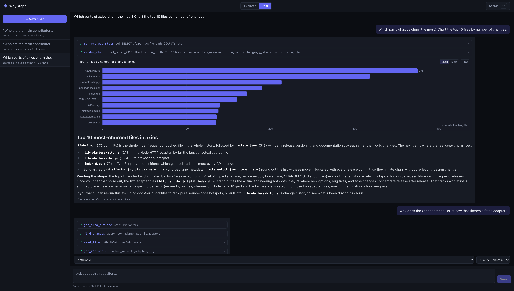
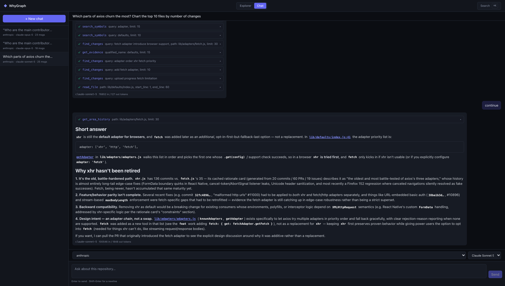

# Your Repo Has Answers. Now It Takes Questions.

*By Tsvetoslav N.*

## The commit that called itself "wip"

A bug report comes in, written the way bug reports are always written: "sessions vanish after a refresh." Not "the reconciliation logic drops rows on reload" - just the symptom, in the vocabulary of behaviour. Nobody remembers touching sessions. You open `git log` and it offers you "wip", "fix", and "more fixes", which is about as much help as a shrug. Somewhere in there is the change that broke things, described by nobody, in no words you can search for.

Now the other version of that morning. You open a chat window that sits on top of your repository, type the symptom exactly as the user reported it, and it comes back with the commit. Not because anyone wrote a good message that day, but because WhyGraph had already described that commit in plain language, from what actually changed in the code - and "the thread no longer restores its messages after a reload" happens to be written in the same vocabulary the bug arrived in.

Earlier this year we introduced [WhyGraph](https://mtr-design.com/news/your-code-knows-what-whygraph-knows-why), a layer that mines your git history for the *why* behind your code and hands it to your AI editor before it edits, so it stops deleting load-bearing retry loops. Near the end of that post there was a quiet observation: the same layer that stops a bad edit is also a clean, ground-truth feed about your codebase. Sitting on that feed, the obvious next question wrote itself: why do only the agents get to ask?

So we built the part for the humans. It is one command: `whygraph serve`.

## One panel, two views

`whygraph serve` starts a local web panel at `http://localhost:8765`, and everything in this post lives inside it. There are two views, switchable in the header.

The first is the **Explorer**. On the left, your code as a containment tree: directories, files, classes, methods. In the middle, a graph. On the right, a detail panel for whatever you select: what it calls and what calls it, its rationale card (purpose, why, constraints, tradeoffs, risks), the raw evidence behind it - the commits, the pull requests, the issues those PRs closed - and its full history. The landing view is a map of the whole repository where every directory is colored by how much of it you have already asked "why" about. Cards are generated lazily and cached, so the map starts mostly unexplored and fills in as you browse: a chart of your own curiosity, which turns out to be more motivating than it sounds. ⌘K finds any symbol from anywhere. One mechanical note for the skeptics: the layout is computed server-side, so the browser never runs a layout engine, which is why the graph stays fast instead of wobbling into place.





The only thing in the Explorer that writes anything is the explicit **Generate rationale** button. Everything else reads.

The second view is the **Chat**: a session sidebar and a streaming conversation thread. It is the more interesting of the two, and the rest of this post is mostly about what you can ask it.

## The assistant, and what it stands on

The chat is an agent in the ordinary current sense of the word: a model in a loop with tools. Seventeen of them, covering the three things WhyGraph knows about your repository.

1. **Structure.** Find a symbol, outline an area, walk callers and callees - the shape of the code as it is today.
2. **Intent.** The same rationale and evidence tools your AI editor gets over MCP, the protocol these tools use to reach external context. Same cards, same cache: if your editor already asked about a function, the chat's answer is instant, and the other way around.
3. **The record of change.** Commits, pull requests, issues, recent activity - plus aggregate statistics over all of it, and a clamped, read-only view of the current source files.

Underneath all three sits the detail that makes the answers trustworthy, the same one that carried the last post: every commit in that record has a description generated from the raw diff alone. The developer's commit message is never shown to the generator. The assistant is explicitly instructed to treat that description as the authoritative account of what changed, and to cite the human-written message "for intent, not for fact". So when it tells you what happened in your repository last month, the answer does not depend on anyone on your team having written honest commit messages. Which is fortunate, because - see above - "wip".

Everything arrives streaming, and every tool call appears in the thread as an expandable activity card: you watch the assistant search, read, and query rather than take its word for it. Claims come back with file-and-line references, commit SHAs, or PR numbers, and when it mentions a symbol, the mention is a link that jumps straight into the Explorer graph, focused on that symbol. Sessions persist in WhyGraph's own database, so a conversation survives a restart. Bring an API key for any of the four supported providers (Anthropic, OpenAI, DeepSeek, OpenRouter) and pick your model per session.

## What you can actually ask it

Four families of questions, taken from the ones we catch ourselves asking daily.

**"What did the team ship in July?"** The summary question, and the one commit messages answer worst. The assistant pulls recent activity and runs aggregate statistics over commits, PRs, and issues: velocity by month, the files that keep churning, contributor breakdowns, how long PRs take to merge. Two details here earn their keep. Contributors are resolved to one row per human, from evidence - your mailmap, GitHub's own records, noreply addresses - never by fuzzy name-matching, so the summary does not credit the same person three times for three git identities. And the statistics surface flatly refuses to dress commit counts up as productivity; that rule is written into the tool itself, not into a hope.



**"Show me."** Any aggregate can become a chart in the thread: lines, bars, horizontal bars, stacked bars, each rendered with a data table alongside and a PNG export. The engineering detail we are proudest of: the model never retypes numbers into a chart. It names columns from a result it already produced, and the chart is drawn from that result directly, so the chart cannot disagree with the data. If you have ever watched a model transcribe a table and quietly lose a digit on the way, you know exactly why this rule exists.



**"When did sessions stop surviving a refresh?"** The opening scene, generalized. Defects get reported in the vocabulary of behaviour, and the diff-derived descriptions are the only record of your repository written in that same vocabulary. So the assistant's `find_changes` tool searches them, and finds the guilty change under whatever one-word message it was committed with. Then the evidence tools produce the receipts: the PR that merged it, the review discussion, the issue it closed.

**"How long do payments changes usually take here?"** The assistant computes durations from your recorded timestamps: PR cycle time, the gap between a PR opening and merging, per-module history. Ask, and it will tell you that payments-module PRs have historically taken about a week from open to merge, with the numbers behind the claim. What it will not do is dress that up as a promise about the next one. It is inference over your own recorded history - which is the honest version of the answer, and often the only version your planning meeting actually needed.

And then there is the fifth, unglamorous family that quietly gets the most use: plain codebase questions. What does this module do. Who calls this. Why does this exist at all. Answered with citations, which is rather the point.



*The answers were always in the repo - the missing piece was something that could read all of it at once and show its work.*

## Built to be doubted

An assistant sitting on top of your repository invites two reasonable fears: that it will make things up, and that it will leak or break something. Both were design inputs, not afterthoughts.

Against making things up: the assistant's instructions treat an answer that could have been grounded in a tool call but wasn't as a worse answer, full stop. Claims carry citations. The activity cards make every lookup visible in the thread. And the chart rule from above applies the same idea to numbers: nothing is retyped, so nothing is mistyped.

Against leaks and damage: the panel binds to localhost only, one user, no accounts, and the whole surface is read-only apart from the explicit Generate button and the chat's card generation. The statistics tools run aggregate-only SQL on a read-only connection, and what they may read is decided by SQLite's own authorizer - enforced by the database, not by the prompt. A query that reaches for something off-limits is refused by the engine itself, not politely declined by the model. The assistant's SQL cannot read the chat's own transcripts. Its file reader refuses WhyGraph's config, the databases, and anything that looks like `.env`. And repository content is treated as data, never as instructions: if something in a README tries to give the model orders, it gets reported as a finding, not obeyed.

One line on money, since agents have a reputation to live down: rationale generation from chat is budgeted per turn - two by default - so a long, curious session cannot quietly ring up an LLM bill while you are not looking.

## When to reach for it, and when not

Reach for it when the repository has real, scanned history. The assistant is exactly as informed as `whygraph scan` has made it: years of commits, PRs, and closed issues make it genuinely useful; a three-commit greenfield gives it little to say. It earns its place fastest with engineering leads who want "what actually shipped" answers that do not depend on commit-message discipline, and with anyone onboarding onto a codebase whose original authors are long gone - interrogating the history beats excavating it.

The flip side, stated plainly. Descriptions are backfilled lazily, so a freshly scanned repository answers history questions with partial coverage at first, and it says so rather than bluffing. Chat needs an API key for one of the four cloud providers; local models are deliberately not wired in yet, because their tool-calling is not yet reliable enough to trust with this job. It is a single-user panel on your machine, not a hosted service for your whole team. And the duration answers are history, not prophecy: it can tell you what payments PRs took, not what the next one will take. An assistant with receipts is still an assistant - better-informed, not infallible.

## Try it

WhyGraph still needs nothing on the host but Docker. One line to install:

```bash
curl -fsSL https://raw.githubusercontent.com/mtrdesign/whygraph/v1.1.0/scripts/install.sh | sh
```

Then, from the repository you want to talk to:

```bash
whygraph init                 # bootstrap the WhyGraph DB + write config
whygraph scan                 # crawl history + refresh CodeGraph + LLM descriptions
whygraph init --agent claude  # wire the MCP server into your editor
whygraph-mcp                  # sanity-check the server (Ctrl-C to exit)
whygraph serve                # browse the graph, evidence + rationale in a local web panel
```

Open `http://localhost:8765`, pick a provider, and ask it what shipped last month. And because the whole thing is one Docker image, it installs on a server exactly the way it installs on a laptop; `whygraph serve --detach` runs it as a background service. Full documentation lives at https://mtrdesign.github.io/whygraph/ and the source is on GitHub at https://github.com/mtrdesign/whygraph.

The last post ended with an AI agent that had to read why your weird retry loop exists before deleting it. This one ends with you, asking your repository who wrote that loop, when, and what it was protecting - and getting an answer with receipts. Which, most days, is exactly the answer you wanted.
